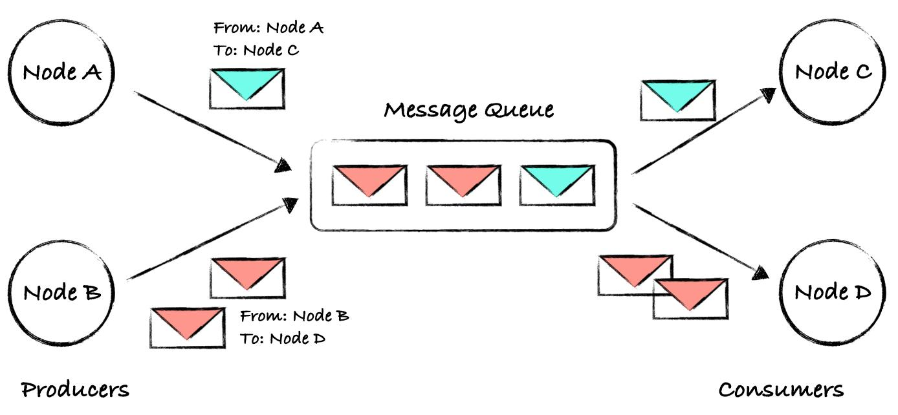

# Server

**Ubicación en el pipeline:**

```
  [Go gRPC Server] ── publica →  [RabbitMQ]  ── consume → [Go Consumer]
```

## ¿Qué es RabbitMQ? 

Un *message broker* es un sistema intermediario que recibe, almacena y distribuye mensajes entre productores y consumidores.

Es el patrón productor/consumidor que estudiaste, pero entre procesos distribuidos en red. En lugar de un buffer en      
memoria compartida, el buffer es RabbitMQ corriendo en otro proceso (o máquina).

```
  Productor          Buffer           Consumidor
  [Tu servidor] → [RabbitMQ queue] → [Go Consumer]
```



## ¿Por qué existe en este pipeline?

El servidor gRPC puede recibir miles de reportes por segundo. El consumer que escribe a Valkey puede ser más lento. RabbitMQ actúa como amortiguador — acumula los mensajes y los entrega al ritmo que el consumer puede procesar.

Sin RabbitMQ, si el consumer es lento, tu servidor gRPC se bloquea. Con RabbitMQ, el servidor publica y sigue adelante.

## La librería en Go                         
                   
Para hablar con RabbitMQ desde Go se usa amqp091-go. Cuando te conectas exitosamente, la librería te devuelve dos cosas:

1. Una *amqp.Connection — la conexión TCP al servidor RabbitMQ
    - Es como el socket TCP — la conexión física con el servidor RabbitMQ. Ocupa recursos en el OS (file descriptor, buffers, etc.).                      
2. Un *amqp.Channel — el canal por donde publicas mensajes
    - Es como un canal virtual que vive dentro de esa conexión. Puedes tener muchos channels sobre una sola connection.

## ¿qué pasa si el *amqp.Channel falla o se cierra inesperadamente? 
Con solo el channel guardado, no se puede recuperar — si en caso se pierde la referencia a la connection y no se puede abrir un channel nuevo.                           
                  
* Con ambos guardados, el struct puede hacer: connection.Channel() → abre un channel nuevo sin reconectar

* Eso se conecta con algo de SO1: tolerancia a fallos en IPC. Los canales de comunicación entre procesos pueden fallar, y un sistema robusto necesita poder reestablecerlos sin reiniciar todo. 

## Fail - Fast 
Si la conexión a RabbitMQ falla, el proceso muere en main.go antes de levantar el servidor gRPC.

Cuando el proceso muere limpio en ``main.go`` antes de levantar, **Kubernetes** lo detecta inmediatamente como un **pod** que no arrancó y puede reiniciarlo o reportar el error. Si falla adentro de una **goroutine** atendiendo peticiones, el **pod** sigue "vivo" para Kubernetes pero está en estado corrupto sirviendo errores silenciosamente.

Ese concepto se llama **liveness** — y es crítico en sistemas distribuidos. 

```bash
pipeline

Locust → Rust API → Go Client → [Go gRPC SERVER] → RabbitMQ → Consumer → Valkey → Grafana                            
                                          ↑                                          
                                        ACTUAL
```

## Warreport_grpc_.pb.go

La interfaz cuenta con dos metodos:

* **SendReport:** Es el método de negocio. El RPC que se definio en el ``.proto``. El server tiene que implementarlo para procesar los reportes militares que llegan del gRPC Client.

* **mustEmbedUnimplementedWarReportServiceServer:** Este es un mecanismo de protección de gPRC en Go. En lugar de implementarlo manualmente, protoc genera un struct auxiliar llamado **UnimplementedWarReportServiceServer**. Si se **embeds** dentro del **Server**, ese método queda satisfecho automaticamente.

El ``UnimplementedWarReportServiceServer`` ya implementa todos los métodos de la interfaz con respuestas de error por defecto. Al embederlo en el Server, el struct hereda esas implementaciones automáticamente. 

El **SendReport** es el método de negocio. Su firma en Go debe coincidir exactamente con lo que la interfaz exige.

```Go
func (s *Server) SendReport(ctx context.Context, req *proto.WarReportRequest) (*proto.WarReportResponse, error) 
```