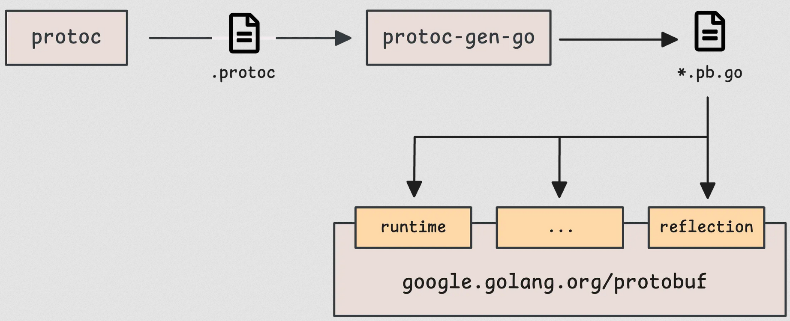
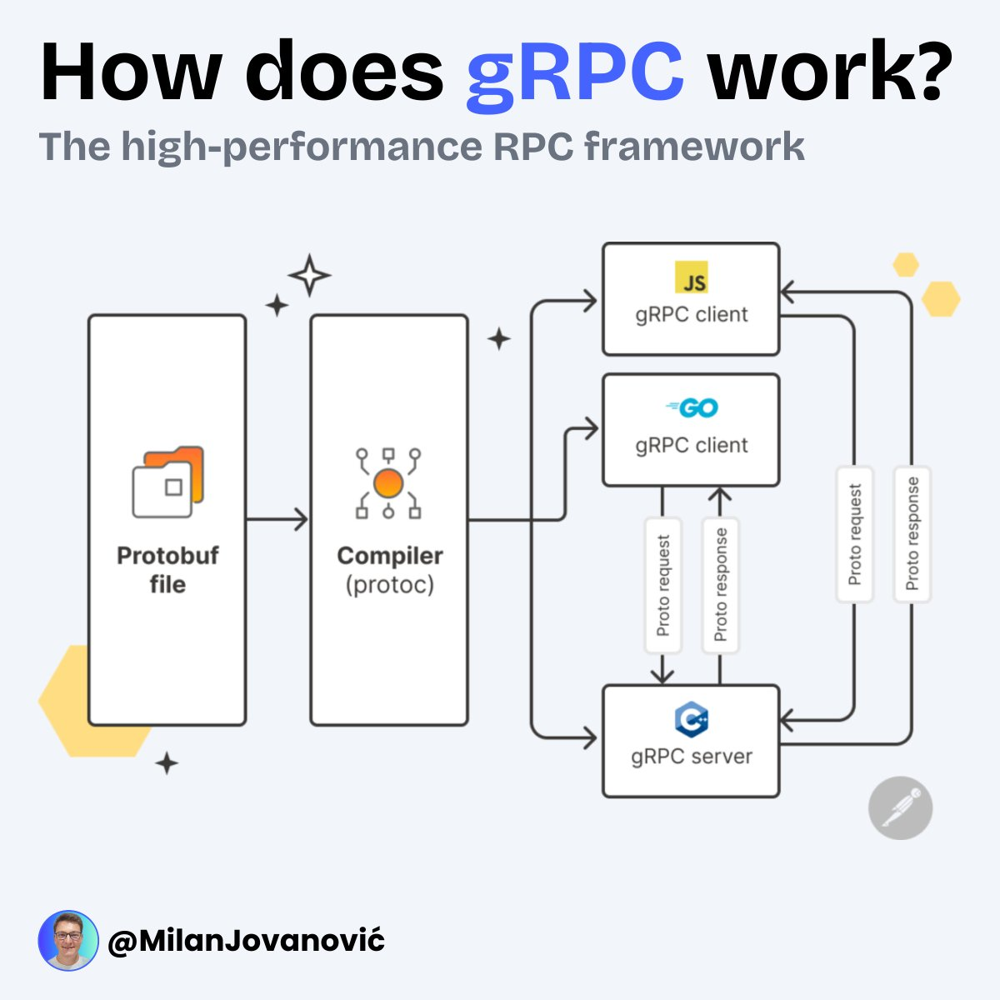

# Protocol Buffer

## Que es un archivo .proto?
                            
Piénsalo como un contrato entre dos programas. Cuando el servicio Go gRPC Client quiere hablarle al Go gRPC Server,
ambos necesitan hablar el mismo "idioma". El .proto define ese idioma: qué datos se envían, qué tipo son, 
y qué operaciones existen.

## Que es gRPC

Google Remote Procedure Call, es un framework de código abierto, de alto rendimiento, desarrollado por Google para facilitar la comunicación entre servicios (microservicios) y aplicaciones cliente-servidor. Utiliza HTTP/2 para transporte y Protocol Buffers como lenguaje de definición de interfaz para serializar datos en binario, siendo más rápido y ligero que REST/JSON.

